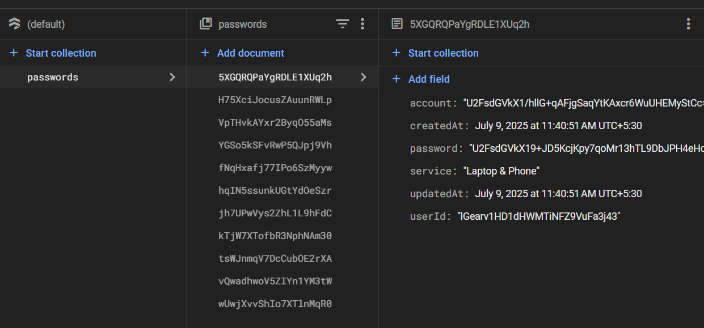

# ⚡ PassNext


Welcome to **PassNext** – the password manager that takes your security (and your bad password habits) seriously, so you don’t have to! 🔐

## What is this?

PassNext is a modern, open-source password manager built with Expo, React Native, and Firebase. It’s designed to keep your secrets safe, your passwords strong, and your life a little less hackable. And yes, it’s actually fun to use!

## Why should I trust you?


Because we encrypt everything. Seriously. Don’t believe us? Here’s a real screenshot of our encrypted database:

<!-- Actual encrypted DB screenshot below! -->


See? Even we can’t read your passwords. (And if you can, please let us know. We’ll panic 😱 together.)

## Features

- 🔒 **Biometric Authentication**: Use your face or fingerprint to unlock your vault. (Sorry, no retina scans. Yet.)
- 🛡️ **Password Strength Meter**: Tells you if your password is strong, weak, or “password123”.
- 🚨 **Breach Monitoring**: Alerts you if your password is found in a data breach. (Yikes!)
- ⏰ **Password Expiry Reminders**: Because old passwords are so last year.
- 📊 **Security Dashboard**: Get a bird’s-eye view of your password health.
- 🤖 **Password Generator**: Make strong, random passwords with a single tap.
- ☁️ **Cloud Sync**: Your passwords, everywhere you go.
- 🌗 **Dark/Light Mode**: For your eyes’ comfort (and your hacker aesthetic).

## Quick Start

1. **Clone this repo:**
   ```bash
   git clone https://github.com/vrushal09/PassNext.git
   cd PassNext
   ```
2. **Install dependencies:**
   ```bash
   npm install
   ```
3. **Start the app:**
   ```bash
   npm start
   ```
4. **Scan the QR code with Expo Go or run on your emulator.**

## Tech Stack

- [Expo](https://expo.dev/) + [React Native](https://reactnative.dev/)
- [Firebase](https://firebase.google.com/) (Auth, Firestore)
- [zxcvbn](https://github.com/dropbox/zxcvbn) for password strength
- [CryptoJS](https://github.com/brix/crypto-js) for encryption

## Contributing

Pull requests are welcome! If you find a bug or have a feature idea, open an issue or PR. If you find a security issue, please don’t open a PR – email us instead so we can fix it before the bad guys do.

## License

MIT. Use it, fork it, break it, fix it. Just don’t use “password” as your password, please.

---

Made with ❤️, ☕, and a lot of random passwords.
